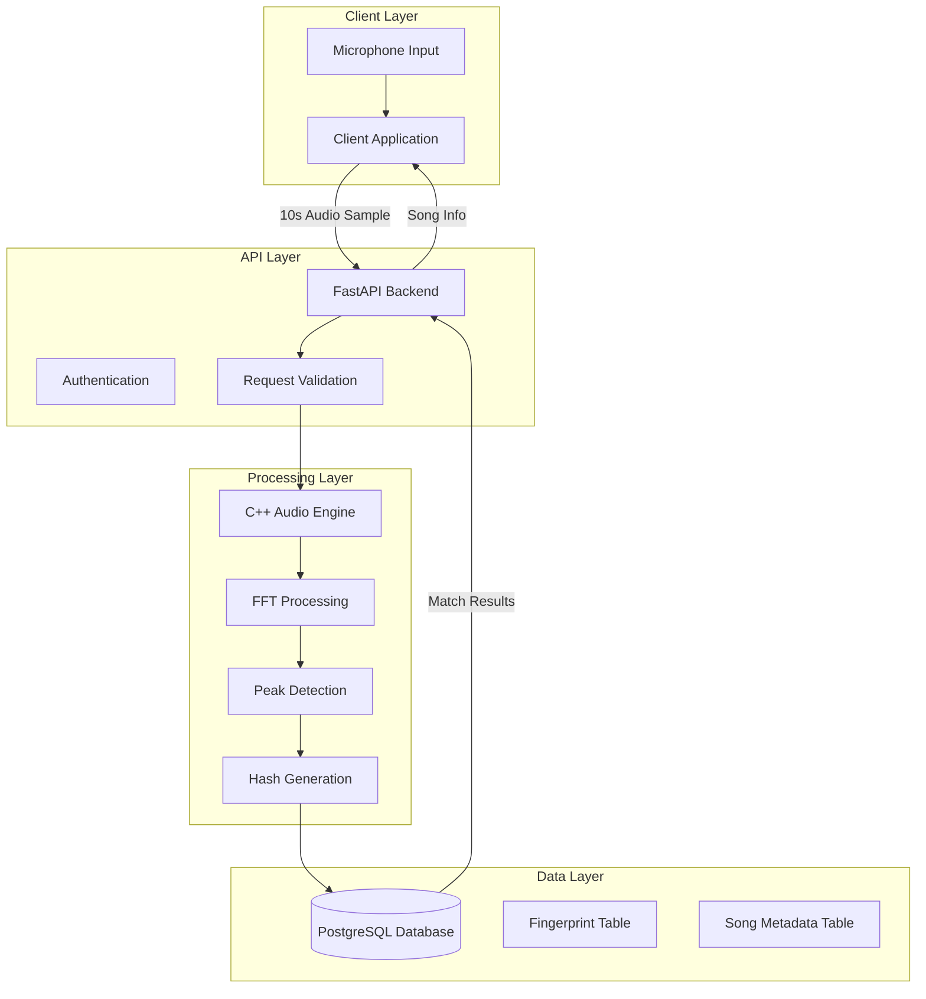

# Audio Fingerprinting System Design

## Overview

The audio fingerprinting system follows a client-server architecture with three main components: a cross-platform client application for audio recording, a FastAPI backend server for processing and matching, and a C++ audio fingerprinting engine for spectral analysis. The system uses PostgreSQL for storing fingerprint hashes and song metadata, enabling fast similarity searches through indexed hash tables.

## Architecture



## Components and Interfaces

### Client Application

- **Technology**: Electron (desktop) / React Native (mobile)
- **Audio Recording**: Web Audio API / Native audio APIs
- **Interface**: RESTful HTTP client
- **Responsibilities**:
  - Capture 10-second audio samples at 44.1kHz/16-bit
  - Encode audio as WAV or MP3 for transmission
  - Display recording progress and results
  - Handle network errors and retry logic

### FastAPI Backend Server

- **Technology**: Python FastAPI with async/await
- **Interface**: REST endpoints with JSON payloads
- **Key Endpoints**:
  - `POST /api/v1/identify` - Audio identification
  - `POST /api/v1/admin/add-song` - Add reference songs
  - `GET /api/v1/health` - Health check
- **Responsibilities**:
  - Validate audio format and size (max 10MB)
  - Interface with C++ audio engine via Python bindings
  - Query PostgreSQL for fingerprint matches
  - Return structured JSON responses with song metadata

### C++ Audio Fingerprinting Engine

- **Technology**: C++17 with Python bindings (pybind11)
- **Dependencies**: FFTW3 for FFT, custom peak detection
- **Algorithm**: Landmark-based fingerprinting similar to Shazam
- **Process Flow**:
  1. Convert audio to mono, resample to 11.025kHz
  2. Compute STFT with 2048-sample windows, 50% overlap
  3. Identify spectral peaks above adaptive threshold
  4. Generate landmark pairs from peak constellations
  5. Hash landmark pairs into 32-bit fingerprint values
- **Interface**: Python module with `generate_fingerprint()` and `batch_process()` functions

### PostgreSQL Database

- **Schema Design**:

  ```sql
  -- Song metadata table
  CREATE TABLE songs (
      id SERIAL PRIMARY KEY,
      title VARCHAR(255) NOT NULL,
      artist VARCHAR(255) NOT NULL,
      album VARCHAR(255),
      duration_seconds INTEGER,
      created_at TIMESTAMP DEFAULT NOW()
  );

  -- Fingerprint hash table
  CREATE TABLE fingerprints (
      id BIGSERIAL PRIMARY KEY,
      song_id INTEGER REFERENCES songs(id),
      hash_value BIGINT NOT NULL,
      time_offset_ms INTEGER NOT NULL,
      created_at TIMESTAMP DEFAULT NOW()
  );

  -- Indexes for fast lookups
  CREATE INDEX idx_fingerprints_hash ON fingerprints(hash_value);
  CREATE INDEX idx_fingerprints_song_time ON fingerprints(song_id, time_offset_ms);
  ```

## Data Models

### Audio Sample

```python
class AudioSample:
    data: bytes          # Raw audio data
    sample_rate: int     # Samples per second (44100)
    channels: int        # Number of channels (1 for mono)
    duration_ms: int     # Duration in milliseconds
    format: str          # Audio format (wav, mp3)
```

### Fingerprint

```python
class Fingerprint:
    hash_value: int      # 32-bit hash of landmark pair
    time_offset_ms: int  # Time position in original audio
    frequency_1: float   # First landmark frequency (Hz)
    frequency_2: float   # Second landmark frequency (Hz)
    time_delta_ms: int   # Time difference between landmarks
```

### Match Result

```python
class MatchResult:
    song_id: int         # Database song identifier
    title: str           # Song title
    artist: str          # Artist name
    album: str           # Album name (optional)
    confidence: float    # Match confidence (0.0-1.0)
    match_count: int     # Number of matching fingerprints
    time_offset_ms: int  # Estimated position in original song
```

## Error Handling

### Client-Side Errors

- **Microphone Access Denied**: Prompt user to enable permissions
- **Network Timeout**: Retry with exponential backoff (3 attempts)
- **Audio Recording Failure**: Display error message and retry option
- **Invalid Response**: Log error details and show generic failure message

### Server-Side Errors

- **Invalid Audio Format**: Return HTTP 400 with format requirements
- **Audio Processing Failure**: Return HTTP 500 with error ID for tracking
- **Database Connection Error**: Return HTTP 503 with retry-after header
- **Engine Crash**: Restart engine process and return HTTP 500

### Database Errors

- **Connection Pool Exhaustion**: Queue requests with timeout
- **Query Timeout**: Return partial results if available
- **Index Corruption**: Rebuild indexes during maintenance window
- **Disk Space**: Alert administrators and reject new uploads

## Testing Strategy

### Unit Testing

- **Audio Engine**: Test fingerprint generation with known audio samples
- **API Endpoints**: Test request validation and response formatting
- **Database Layer**: Test query performance and data integrity
- **Client Components**: Test audio recording and UI interactions

### Integration Testing

- **End-to-End Flow**: Record audio → process → match → display results
- **Performance Testing**: Concurrent user simulation (100+ requests)
- **Database Load Testing**: Large fingerprint database queries
- **Error Scenario Testing**: Network failures, malformed requests

### Reference Data Testing

- **Known Song Database**: Populate with 1000+ reference songs
- **Accuracy Metrics**: Measure identification success rate
- **False Positive Testing**: Ensure non-matching audio returns no results
- **Noise Robustness**: Test with background noise and low-quality audio

## Performance Considerations

### Audio Processing Optimization

- **SIMD Instructions**: Use vectorized operations for FFT computation
- **Memory Management**: Pre-allocate buffers for audio processing
- **Parallel Processing**: Multi-threaded fingerprint generation
- **Cache Optimization**: Keep frequently accessed fingerprints in memory

### Database Optimization

- **Hash Distribution**: Ensure uniform distribution of fingerprint hashes
- **Query Optimization**: Use covering indexes for common queries
- **Connection Pooling**: Maintain persistent database connections
- **Partitioning**: Partition fingerprint table by hash ranges for large datasets

### Scalability Design

- **Horizontal Scaling**: Stateless API servers behind load balancer
- **Caching Layer**: Redis cache for frequent fingerprint lookups
- **CDN Integration**: Cache static assets and API responses
- **Database Sharding**: Distribute fingerprints across multiple databases
